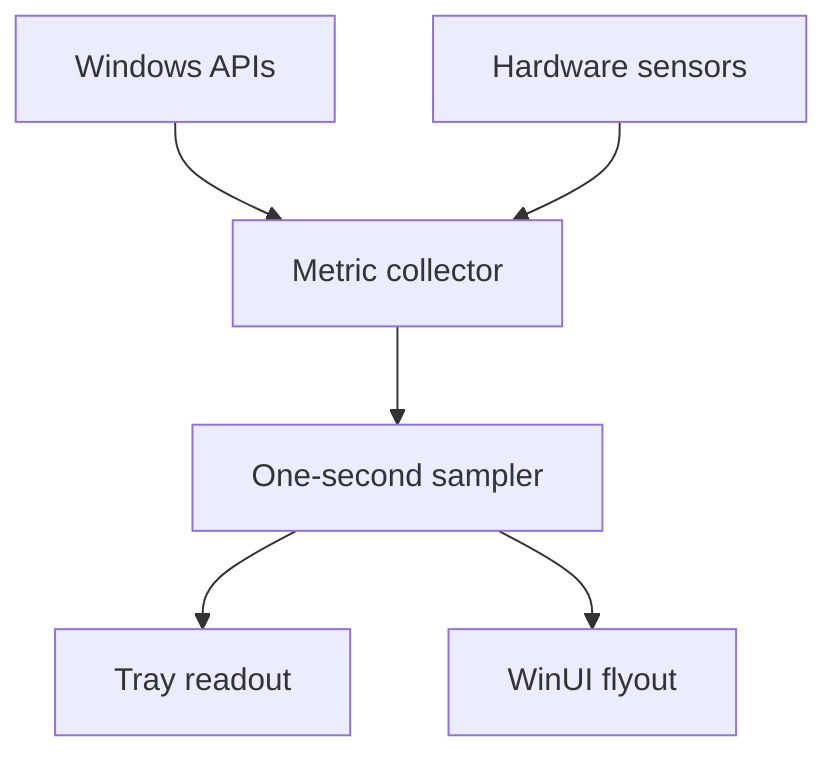

# Windows Taskbar Monitor

[](https://github.com/JohnnyZLi/Windows-Taskbar-Monitor/actions/workflows/build.yml)

A Windows 11-native system monitor that keeps a configurable utilization readout in the notification area and opens a compact Fluent dashboard on demand.

The application samples locally and does not send telemetry. Its first release focuses on the metrics that are useful at a glance without reproducing Task Manager in a smaller window.

## Monitored metrics

| Component | Values |
| --- | --- |
| CPU | Utilization and package temperature when exposed |
| GPU | Utilization and core temperature when exposed |
| Memory | Used capacity, total capacity, and utilization |
| Disk | Aggregate physical-disk read and write throughput |
| Network | Aggregate active-adapter download and upload throughput |

The tray icon can display CPU, GPU, or memory utilization. Clicking it opens the dashboard; right-clicking provides Open and Exit commands.

## Interface

- Native WinUI 3 controls and Windows App SDK
- Acrylic transient surface with system light, dark, and high-contrast behavior
- Windows accent-colored live tray readout
- Sixty-second sparklines sampled once per second
- Borderless, always-on-top flyout positioned next to the notification icon
- Saved tray-metric preference

Windows exposes notification-area icons through `Shell_NotifyIcon`; it does not provide a supported extension point for placing arbitrary controls inside the main taskbar. This project stays within that supported shell model.

## Architecture



- `GetSystemTimes` supplies CPU utilization.
- `GlobalMemoryStatusEx` supplies physical-memory capacity.
- PDH English counters supply disk throughput and a GPU-usage fallback.
- Network-interface byte counters are converted to rates using monotonic deltas.
- LibreHardwareMonitor supplies supported CPU/GPU temperatures and preferred GPU load.
- The reusable core project owns formatting, rate calculation, bounds, and circular history behavior.

See [`docs/architecture.md`](docs/architecture.md) for failure handling and metric semantics.

## Build and run

Requirements:

- Windows 11 x64
- .NET 10 SDK
- Visual Studio 2022 with Windows application development tooling, or the .NET CLI

```powershell
git clone https://github.com/JohnnyZLi/Windows-Taskbar-Monitor.git
cd Windows-Taskbar-Monitor
dotnet run --project src/WindowsTaskbarMonitor.App -p:Platform=x64
```

GitHub Actions also publishes a self-contained `TaskbarMonitor-win-x64` artifact for every successful build. The artifact is not code-signed, so Windows may identify it as an unrecognized application.

## Sensor support

CPU and GPU temperatures are not standardized across Windows hardware. The application uses LibreHardwareMonitor where possible, but some systems require elevated hardware access or do not expose a compatible sensor at all. The UI reports **Unavailable** instead of fabricating a value or requiring administrator rights at startup.

GPU usage falls back to Windows GPU Engine counters when a hardware-library load sensor is unavailable. Ordinary CPU, memory, disk, and network monitoring remains independent of temperature support.

## Validate

```powershell
dotnet test tests/WindowsTaskbarMonitor.Core.Tests
```

The tests cover history ordering, counter resets, elapsed-time rate calculations, percentage bounds, unit formatting, and derived memory utilization. CI runs the portable tests on Linux and builds and publishes the native application on Windows.

## Scope

This is a Windows 11 x64 application. It does not support Windows 10, alter fan controls, clean memory, terminate processes, or install a kernel driver. Per-process statistics, multiple-GPU selection, startup registration, signed packaging, and configurable graph colors are possible later additions.

## License

MIT. LibreHardwareMonitor is an MPL-2.0 dependency; see [`THIRD-PARTY-NOTICES.md`](THIRD-PARTY-NOTICES.md).
